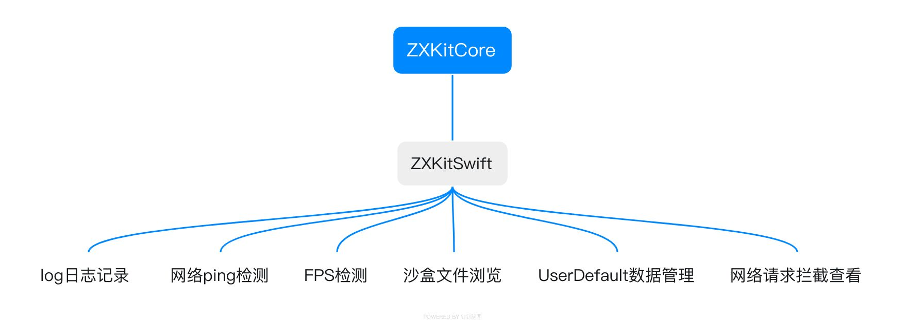

# ZXKitSwift

   


[english](./README_en.md)

`ZXKitSwift`是一个iOS端的调试工具的集合，将多个`ZXKitCore`插件进行了集成。如果想继续集成其他[ZXKitCore](https://github.com/DamonHu/core)插件，请查看 `ZXKitCore` 的开发文档。

## 集成ZXKitSwift

```ruby
pod 'ZXKitSwift'
```

## 使用ZXKitSwift

2、导入头文件

```swift
import ZXKitSwift
```

3、一键注册所有内置工具，`AppDelegate`启动函数可以注册

```
func application(_ application: UIApplication, didFinishLaunchingWithOptions launchOptions: [UIApplication.LaunchOptionsKey: Any]?) -> Bool {
	
	//注册所有内置插件
	ZXKit.registPlugin()
	
	return true
}
```
4、显示工具列表

```swift
ZXKit.show()
```
5、隐藏工具弹窗

```swift
ZXKit.hide()
```
6、关闭工具弹窗

```swift
ZXKit.close()
```

## ZXKitSwift内置插件功能



- [x] log日志 ☞ [ZXKitCode/logger](https://github.com/ZXKitCode/logger)
- [x] 网络ping检测 ☞ [DamonHu/HDPingTools](https://github.com/DamonHu/HDPingTools)
- [x] FPS检测 ☞ [ZXKitCode/FPS](https://github.com/ZXKitCode/FPS)
- [x] 沙盒文件浏览 ☞ [ZXKitCode/ZXFileBrowser](https://github.com/ZXKitCode/ZXFileBrowser)
- [x] UserDefault数据管理 ☞ [ZXKitCode/ZXUserDefaultManager](https://github.com/ZXKitCode/ZXUserDefaultManager)
- [x] 网络请求拦截查看 ☞ [ZXKitCode/netfox-zxkit](https://github.com/ZXKitCode/netfox-zxkit)

## 效果预览


## License

该项目基于MIT协议，您可以自由修改使用