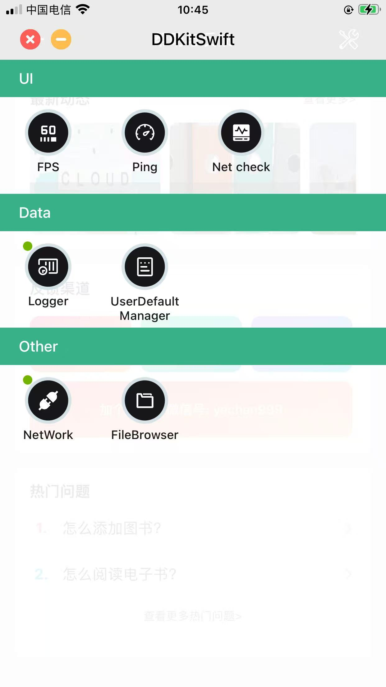

# DDKitSwift

   

Previously developed debugging frameworks were somewhat scattered, so the goal was to create a universal framework that could combine different debugging tools through a plugin structure. This tool is designed for efficient problem solving rather than being comprehensive. Therefore, features that might affect App Store submission, such as private iOS functions and disabled interfaces, are not provided by default.

The previous name was `ZXKitSwift`, inspired by the novel "Zhu Xian". Due to maintenance costs for the domain and changes in the novel's ending, the name has been changed, dependencies have been removed, and updates have been made. This library is now released as DDKitSwift.

### [中文文档](https://dongge.org/blog/1307.html)

## Project Preview



## Features List

The following plugins are built-in and ready to use:

* 🐛 Log logging
* 📡 Network Connectivity Test 
* 📶 Network ping detection
* 📱 FPS detection
* 📂 Sandbox file browsing
* 📋 UserDefault data management 
* 🌐 Network request interception and viewing 

## Integrating DDKitSwift

1. Use CocoaPods to select the functionalities you need. You can combine them as needed.

**Required**

```
pod 'DDKitSwift'
```

**optional:** Each feature is packaged as an independent module and can be added or removed as needed.

```
pod 'DDKitSwift_NetCheck'
pod 'DDKitSwift_Netfox'
pod 'DDKitSwift_FPS'
pod 'DDKitSwift_Ping'
pod 'DDKitSwift_FileBrowser'
pod 'DDKitSwift_UserDefaultManager'
```

## Using DDKitSwift

2. Import the header files

```
import DDKitSwift
import DDKitSwift_Netfox
import DDKitSwift_FPS
import DDKitSwift_Ping
import DDKitSwift_FileBrowser
import DDKitSwift_UserDefaultManager
import DDKitSwift_NetCheck
```

3. Register the necessary components in the `AppDelegate` startup function

```
func application(_ application: UIApplication, didFinishLaunchingWithOptions launchOptions: [UIApplication.LaunchOptionsKey: Any]?) -> Bool {
	
	DDKitSwift.regist(plugin: DDKitSwift_Netfox())
	DDKitSwift.regist(plugin: DDKitSwift_FPS())
	//Specify target URL
	DDKitSwift.regist(plugin: DDKitSwift_NetCheck(url: "https://baidu.com"))
	//Specify target URL
   	DDKitSwift.regist(plugin: DDKitSwift_Ping(url: "https://baidu.com"))
   	DDKitSwift.regist(plugin: DDKitSwift_FileBrowser())
	DDKitSwift.regist(plugin: DDKitSwift_UserDefaultManager())
	
	return true
}
```

4. Show the tools list

```
DDKitSwift.show()
```

5. Hide the tools popup

```
DDKitSwift.hide()
```

6. Close the tools popup

```
DDKitSwift.close()
```

## Advanced Operations

Advanced operations provide a way to integrate personalized plugins. The process remains simple, with the additional step of self-registration compared to direct default integration.

## Custom Plugin Integration

`DDKitSwift` comes with a set of pre-installed default functions and supports custom plugin integration. Simply import the corresponding library and register it in the `AppDelegate` startup function.

## Developing Custom Plugins

If you need to develop custom plugins, implement the `DDKitSwiftPluginProtocol`. Then call the `DDKitSwift.regist(plugin: )` function to automatically load and display the plugin.
