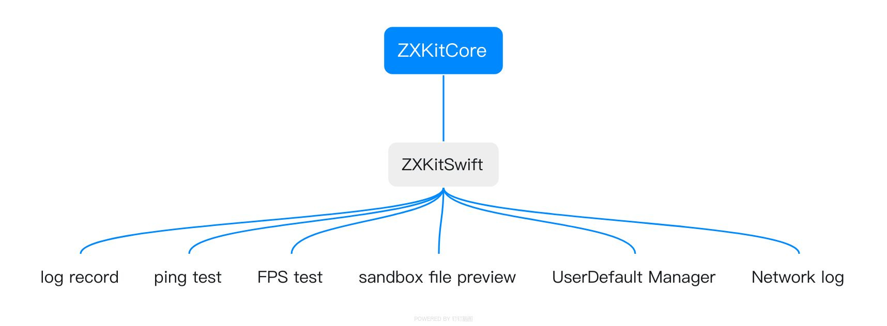

# ZXKitSwift

   


[中文文档](./README.md)

`ZXKitSwift` is a collection of debugging tools for iOS platform. If you want to continue integrating other [ZXKitCore](https://github.com/ZXKitCode/core) Plugins, please check the development documentation of `ZXKitCore`.

## Integrate ZXKit

1、 cocoapods

```ruby
pod 'ZXKitSwift'
```

## Use ZXKit

2、 Import the header file

```swift
import ZXKitSwift
```

3、Register all built-in plug-ins

```swift
func application(_ application: UIApplication, didFinishLaunchingWithOptions launchOptions: [UIApplication.LaunchOptionsKey: Any]?) -> Bool {
	
	//Register all built-in plug-ins
	ZXKit.registPlugin()
	
	return true
}
```

4、Display the list of tools

```swift
ZXKit.show()
```

5、hide the list of tools

```swift
ZXKit.hide()
```

6、close ZXKit

```swift
ZXKit.close()
```

## ZXKitSwift built-in plug-in function



- [x] log ☞ [DamonHu/logger](https://github.com/DamonHu/logger)
- [x] network ping test  ☞ [DamonHu/HDPingTools](https://github.com/DamonHu/HDPingTools)
- [x] FPS display ☞ [DamonHu/FPS](https://github.com/DamonHu/FPS)
- [x] Sandbox FileBrowser ☞ [DamonHu/ZXFileBrowser](https://github.com/DamonHu/ZXFileBrowser)
- [x] UserDefault data manager ☞ [DamonHu/ZXUserDefaultManager](https://github.com/DamonHu/ZXUserDefaultManager)
- [x] network record ☞ [DamonHu/netfox-zxkit](https://github.com/DamonHu/netfox-zxkit)


## preview


## License

The project is based on the MIT License