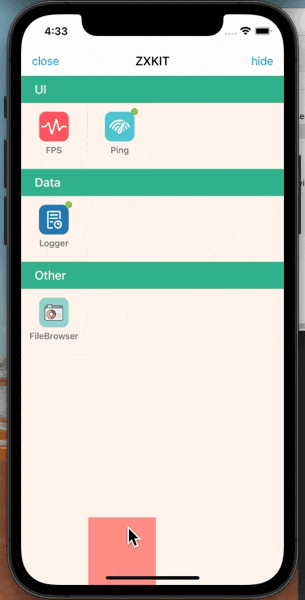

# ZXKit


`ZXKit`是一个iOS端整合的调试工具框架，名字取自我很喜欢的一本小说《诛仙》。

> 天地不仁，以万物为刍狗

因为之前开发的调试框架比较分散，所以希望可以通过一个通用的框架，通过插件的结构去组合不同的调试工具。该工具是为了高效的定位解决问题，而不是追求大而全，所以iOS端私有函数、禁用的接口等影响App Store上线的功能，默认都不会提供。

当然您也可以指定自定义插件安装，未内置的插件可能会调用iOS系统的禁用函数导致审核被拒，集成之前请确认一下哦~

## 集成ZXKit

1、使用cocoapods集成之后即可使用所有功能，如果您只想集成单独的功能，可以查看后面的插件部分接入教程。

```ruby
pod 'ZXKitSwift'
```

## 使用ZXKit

2、导入头文件

```swift
import ZXKitSwift
```

3、一键注册所有内置工具，`AppDelegate`启动函数可以注册

```
func application(_ application: UIApplication, didFinishLaunchingWithOptions launchOptions: [UIApplication.LaunchOptionsKey: Any]?) -> Bool {
	
	//注册所有内置插件
	ZXKit.registPlugin()
	
	return true
}
```
4、显示工具列表

```swift
ZXKit.show()
```
5、隐藏工具弹窗

```swift
ZXKit.hide()
```
6、关闭工具弹窗

```swift
ZXKit.close()
```

## 二、进阶操作

进阶操作提供了个性化插件接入的方式，使用依旧很简单，比直接默认集成多了自己注册的步骤

## 自定义插件接入

`ZXKitSwift`是已经预装默认功能的集合， `ZXKit`还支持使用自定义插件接入，只需要导入对应的库，在`AppDelegate`启动函数注册即可。

例如以下多个插件的接入和注册

```
//log日志
pod 'ZXKitLogger/zxkit'
//注册
ZXKitLogger.registZXKit()

//网络ping检测
pod 'HDPingTools/zxkit'
//注册
ZXKit.regist(plugin: pingTools)

//FPS检测
pod 'ZXKitFPS/zxkit'
//注册
let fps = ZXKitFPS()
fps.registZXKitPlugin()

//沙盒文件管理
pod 'ZXFileBrowser/zxkit'
//注册
ZXKit.regist(plugin: ZXFileBrowser.shared())
```


## 功能列表

- [x] log日志 ☞ [ZXKitCode/logger](https://github.com/ZXKitCode/logger)
- [x] 网络ping检测 ☞ [DamonHu/HDPingTools](https://github.com/DamonHu/HDPingTools)
- [x] FPS检测 ☞ [ZXKitCode/FPS](https://github.com/ZXKitCode/FPS)
- [x] 沙盒文件浏览 ☞ [ZXKitCode/ZXFileBrowser](https://github.com/ZXKitCode/ZXFileBrowser)
- [x] UserDefault数据管理 ☞ [ZXKitCode/ZXUserDefaultManager](https://github.com/ZXKitCode/ZXUserDefaultManager)

## 项目预览



## 自定义插件开发


如果需要开发自定义插件，只需要实现`ZXKitPluginProtocol`即可。实现的方式可以查看[ZXKitCode/core](https://github.com/ZXKitCode/core)的说明文档

## License


Base on Apache-2.0 License